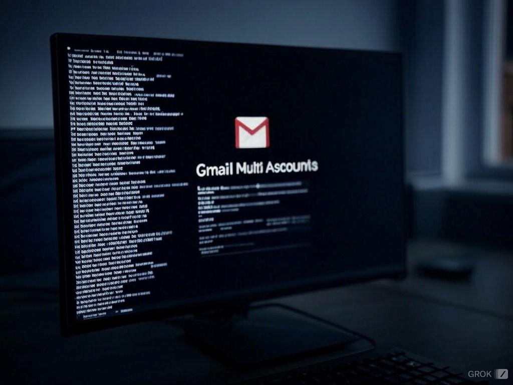
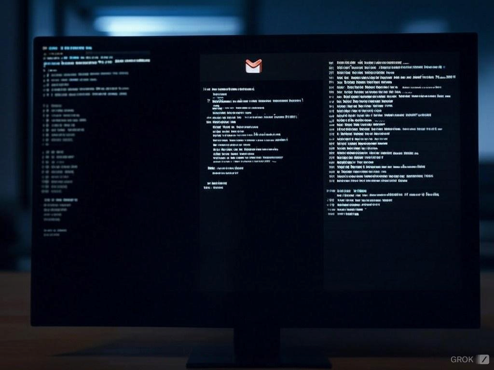

# Gmail Multi-Account CLI

A powerful command-line interface for managing multiple Gmail accounts, built with Python.

## Introduction

Welcome to the Gmail Multi-Account CLI! This tool is designed to help you efficiently manage multiple Gmail accounts from the command line. Whether you need to check emails, send messages, or organize your inbox, this CLI provides a simple and intuitive interface to handle all your Gmail needs. With support for multiple accounts, you can easily switch between different Gmail accounts without logging in and out repeatedly.



## Socials

[](https://github.com/davidtkeane)
[](https://twitter.com/davidtkeane)
[](https://linkedin.com/)

### Github

[](https://github.com/davidtkeane/gmail-multi-cli)

### Github Commits


### Badges


## Table of Contents

- [Features](#features)
- [Requirements](#requirements)
- [Installation](#installation)
- [Setting Up Gmail &#34;Secure App Access&#34;](#setting-up-gmail-less-secure-app-access)
- [Usage](#usage)
- [Configuration](#configuration)
- [Troubleshooting](#troubleshooting)
- [Contributing](#contributing)
- [License](#license)
- [Glossary](#glossary)

<br>



### Time @ Work!

[](https://codetime.dev)

### My Other Cool Scripts.

[](https://github.com/davidtkeane/Sleep-CLI)
[](https://github.com/davidtkeane/PhoneBook-CLI)
[](https://github.com/davidtkeane/kermit)
Join my Discord --> [](https://discord.gg/HZy4TAUK)


## Features

- Manage multiple Gmail accounts from the command line
- Read, send, and forward emails
- View new and older emails
- Colorful and user-friendly interface
- Secure handling of account credentials

## Using App Passwords (Recommended for accounts with 2-Step Verification)

1. Go to your Google Account's App Passwords page: https://myaccount.google.com/apppasswords
2. Select "Mail" and "Other (Custom name)" from the dropdowns.
3. Enter a name for the app (e.g., "Gmail CLI").
4. Click "Generate".
5. Use the generated 16-character password in your `.env` file instead of your regular Gmail password.

**Note**: Keep this password secret and secure!

For more information or support, please open an issue on the GitHub repository.

- Manage multiple Gmail accounts from the command line
- Read, send, and forward emails
- View new and older emails
- Colorful and user-friendly interface
- Secure handling of account credentials

## Requirements

- Python 3.7 or higher
- pip (Python package installer)

## Installation

# Instructions How to Use.

A. gmail_multi_usr_bin.py   <-- This file will be sent to the /usr/local/bin/ folder so you can run gmail from the command line.>

B. gmail_ping_test.py       <-- This file must be in the same folder as gmail_multi.py and .env file to work.>  

This script will test the connections after you get your app password. # Change your name from Bob below in the script. Not below, but below on Line 39 and 40 in gmail_ping_test.py.

        # Get credentials from environment variables (BEST PRACTICE)
        # EMAIL_USER = os.getenv("EMAIL_USER_Bob")
        # EMAIL_PASS = os.getenv("EMAIL_PASS_Bob")

C. usr-bin.sh               <-- This script is to used for sending the gmail_multi_usr_bin.py to the /usr/local/bin/ folder so you can run gmail from the command line.>

D. how_to_use.md            <-- This File will help you setup gmail_multi_usr_bin.py to be able to run on the command line.>

# Note. Both gmail scripts need google user and password, the only difference is that the Bin version has the users and passwords inside the scripts while the gmail_multi.py saves the user names and passwords to a .env file for security. 
# The bin version is also secure, as you will need to use your password to save the files into the location, I did on my Macbook Pro m3. And anytime I change anything I have to enter my password. 

1. Clone the repository:

   ```bash
   git clone https://github.com/yourusername/gmail-multi-cli.git
   cd gmail-multi-cli
   ```
2. Create a virtual environment (optional but recommended): 

   NOTE: I don't myself, but if you don't know what a virtual environment (venv) is then not need to do this.

   ```bash
   python -m venv venv
   source venv/bin/activate  # On Windows, use `venv\Scripts\activate`
   ```
3. Install the required packages:

   ```bash
   pip install -r requirements.txt
   ```
4. Set up your `.env` file with your Gmail account credentials (see [Configuration](#configuration) section).

5. Install the modules needed to run the script Requirements.txt

   Locate a file named `requirements.txt` in your project directory with the following content:

   ```bash
   python-dotenv==0.19.2
   colorama==0.4.4
   ```

   Install requirements.txt

   ```bash
   pip install requirements.txt
   ```
5. Run the script:

   ```bash
   python gmail_multi.py
   ```
6. Congrats!


### Using App Passwords (Recommended for accounts with 2-Step Verification)

An app password is a 16-digit passcode that gives a less secure app or device permission to access your Google Account. App passwords can only be used with accounts that have [2-Step Verification](https://support.google.com/accounts/answer/185839) turned on.

[Create and manage your app passwords](https://myaccount.google.com/apppasswords). You may need to sign in to your Google Account.

If you’ve set up 2-Step Verification but can’t find the option to add an app password, it might be because:

* Your Google Account has 2-Step Verification [set up only for security keys](https://support.google.com/accounts/answer/6103523).
* You’re logged into a work, school, or another organization account.
* Your Google Account has [Advanced Protection](https://support.google.com/accounts/answer/7539956).

**Tip:** Usually, you’ll need to enter an app password once per app or device.

1. To create an app password, you need 2-Step Verification on your Google Account.
2. Go to your Google Account's App Passwords page: https://myaccount.google.com/apppasswords
3. Select "Mail" and "Other (Custom name)" from the dropdowns.
4. Enter a name for the app (e.g., "Gmail CLI").
5. Click "Generate".
6. Use the generated 16-character password in your `.env` file instead of your regular Gmail password.

**Note**: Keep this password secret and secure!

## Usage

After installation and setup, run the script:

```bash
python gmail_multi.py
```

Follow the on-screen prompts to:

1. Select an account
2. Choose an action (read new emails, check older emails, send an email, etc.)
3. Perform email operations

## Configuration

Create a `.env` file in the project root with your Gmail account credentials:

The app password is 16  letter in length with spaces between every 4 letters, example fejylpueanyepjeb

So to add the password like this EMAIL_PASS_TheDude=fejylpueanyepjeb and this format works.

You will need to change you details in 
   1. The .env file see below for the format.
      (See a few lines below) 
   2. You will need to also change your names in the gmail_multi.py @ Line 87 'def select_account():' 
      (See a few lines below) 

1. The .env file

   ```bash
   EMAIL_USER_TheDude=your.email@gmail.com
   EMAIL_PASS_TheDude=app_password

   EMAIL_USER_Man=another.email@gmail.com
   EMAIL_PASS_Man=app_password

   EMAIL_USER_SpaceMan=third.email@gmail.com
   EMAIL_PASS_SpaceMan=app_password
   ```
2. gmail_multi.py

   ```bash
   def select_account():
      print_ascii_gmail2()
      print(Fore.YELLOW + "\nSelect an account:")
      print("1. Bob")
      print("2. Man")
      print("3. Linky")
      print("0. Exit" + Style.RESET_ALL)
   ```

Replace the email addresses and passwords with your actual Gmail credentials.

## Troubleshooting

- **Authentication Error**: Ensure you've enabled "Less Secure App Access" or are using an App Password.
- **Module Not Found Error**: Make sure you've installed all required packages (`pip install -r requirements.txt`).
- **SMTP Connection Error**: Check your internet connection and firewall settings.

## Contributing

Contributions are welcome! Please feel free to submit a Pull Request.

## License

This project is licensed under the MIT License - see the [LICENSE](LICENSE) file for details.

## Glossary

- **CLI**: Command Line Interface - a text-based interface for interacting with a program.
- **IMAP**: Internet Message Access Protocol - used for retrieving emails from a server.
- **SMTP**: Simple Mail Transfer Protocol - used for sending emails.
- **Virtual Environment**: An isolated Python environment that allows you to install packages without affecting your system-wide Python installation.
- **App Password**: A 16-character password that gives a less secure app or device permission to access your Google Account.

---

For more information or support, please open an issue on the GitHub repository.

[](https://buymeacoffee.com/davidtkeane)
